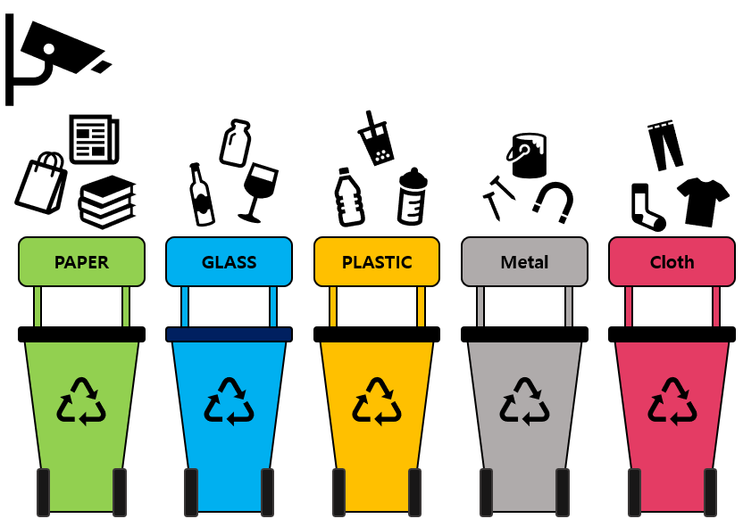
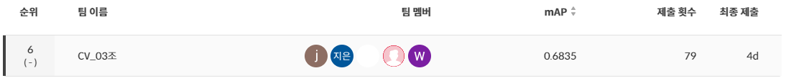

# ♻️ 재활용 품목 분류를 위한 Object Detection

## ✨ 팀 소개

Thanks goes to these wonderful people ([emoji key](https://allcontributors.org/docs/en/emoji-key)):

<table>
  <tr>
    <td align="center"><a href="https://github.com/seungki1011"><br /><sub><b>김승기</b></sub><br />
    <a href="https://github.com/boostcampaitech5/level2_objectdetection-cv-03/commits?author=seungki1011" title="Code">💻</a>
    <a href="https://github.com/boostcampaitech5/level2_objectdetection-cv-03/tree/main/upsampling" title="Data">🔣</a>
    <a href="https://github.com/boostcampaitech5/level2_objectdetection-cv-03/tree/main/mmdetection/configs/_teamconfig_" title="Infrastructure">🚇</a>
    <a href="https://github.com/boostcampaitech5/level2_objectdetection-cv-03/commits/main" title="Maintenance">🚧</a>
    </td>
    <td align="center"><a href="https://github.com/jjjuuuun"><br /><sub><b>김준영</b></sub></a><br />
    <a href="https://github.com/boostcampaitech5/level2_objectdetection-cv-03/commits?author=jjjuuuun" title="Code">💻</a>
    <a href="https://github.com/boostcampaitech5/level2_objectdetection-cv-03/tree/main/mmdetection/configs/_teamconfig_" title="Infrastructure">🚇</a>
    <a href="https://github.com/boostcampaitech5/level2_objectdetection-cv-03/commits/main" title="Maintenance">🚧</a>
    <a href="https://github.com/boostcampaitech5/level2_objectdetection-cv-03" title="projectManagement">📆</a>
    </td>
    <td align="center"><a href="https://github.com/helpmeIamnewbie"><br /><sub><b>전형우</b></sub></a><br />
    <a href="https://github.com/boostcampaitech5/level2_objectdetection-cv-03/commits?author=helpmeIamnewbie" title="Code">💻</a>
    <a href="https://github.com/boostcampaitech5/level2_objectdetection-cv-03" title="Ideas & Planning">🤔</a>
    <a href="https://github.com/boostcampaitech5/level2_objectdetection-cv-03/pulls?q=" title="Reviewed Pull Requests">👀</a>
    <a href="https://github.com/boostcampaitech5/level2_objectdetection-cv-03/commits?author=helpmeIamnewbie" title="Tests">⚠️</a>
    </td>
    <td align="center"><a href="https://github.com/CheonJiEun"><br /><sub><b>천지은</b></sub></a><br />
    <a href="https://github.com/boostcampaitech5/level2_objectdetection-cv-03/commits?author=CheonJiEun" title="Code">💻</a>
    <a href="https://github.com/boostcampaitech5/level2_objectdetection-cv-03/tree/main/upsampling" title="Data">🔣</a>
    <a href="https://github.com/boostcampaitech5/level2_objectdetection-cv-03/tree/main/mmdetection/configs/_teamconfig_" title="Examples">💡</a>
    <a href="https://github.com/boostcampaitech5/level2_objectdetection-cv-03/pulls?q=" title="Research">🔬</a>
    </td>
    <td align="center"><a href="https://github.com/Eyecaramba"><br /><sub><b>신우진</b></sub></a><br />
    <a href="https://github.com/boostcampaitech5/level2_objectdetection-cv-03/commits?author=Eyecaramba" title="Code">💻</a>
    <a href="https://github.com/boostcampaitech5/level2_objectdetection-cv-03" title="Ideas & Planning">🤔</a>
    <a href="https://github.com/boostcampaitech5/level2_objectdetection-cv-03/tree/main/mmdetection/configs/_teamconfig_" title="Infrastructure">🚇</a>
        <a href="https://github.com/boostcampaitech5/level2_objectdetection-cv-03/pulls?q=" title="Reviewed Pull Requests">👀</a>
    </td>
  </tr>
</table>

This project follows the [all-contributors](https://github.com/all-contributors/all-contributors) specification. Contributions of any kind welcome!

## 🎙️ 프로젝트 소개

<p align="center">
    
</p>

요즘 쓰레기 관련 문제들이 항상 문제로 떠오르고 있습니다. 이러한 문제를 해결할 수 있는 방법 중 하나는 분리수거를 잘 하는 것입니다. 잘 분리 배출 된 쓰레기는 자원으로서 가치를 인정받아 재활용되지만, 잘못 분리 배출 되면 그대로 폐기물로 분류되어 매립 또는 소각 되기 때문입니다. 따라서 분리 배출을 잘 하기 위해서 이미지에서 쓰레기를 detection하는 모델을 만들어 보려고 합니다. 쓰레기를 잘 detection하는 모델을 만든다면 쓰레기장에 설치되어 정확한 분리수거를 도울 수 있고 어린 아이들의 분리수거 교육에 사용될 수도 있을 것입니다.

이번 프로젝트는 `부스트캠프 AI Tech` CV 트랙내에서 진행된 대회이며 mAP50으로 최종평가를 진행하게 됩니다.

## 📆 프로젝트 일정

프로젝트 전체 일정

- 2023.05.01 ~ 2023.05.18

프로젝트 세부 일정

- 2023.05.01 ~ 2023.05.05 : Object Detection에 대해 알아보기
- 2023.05.06 ~ 2023.05.08 : EDA
- 2023.05.09 ~ 2023.05.10 : Training Dataset과 Validation Dataset으로 분리, MMDetection 사용법 익히기
- 2023.05.11 ~ 2023.05.12 : Online Augmentation
- 2023.05.13 ~ 2023.05.14 : Offline Augmentation, Model 실험
- 2023.05.15 ~ 2023.05.17 : TTA(Test Time Augmentation), Multi-scale Training & Testing
- 2023.05.18 ~ 2023.05.18 : Ensemble

## 🥼 프로젝트 수행

➡️ Link따라 들어가시면 보실 수 있습니다.

1. [EDA](https://calico-dance-4bf.notion.site/EDA-c883e3e6f9654e81805047fbc831a1dc)
2. [Augmentation](https://calico-dance-4bf.notion.site/Augmentation-f31b33a09cdb42c3941863028fadcda2)
3. [Model-MMDetection](https://calico-dance-4bf.notion.site/Model-215ceba896e54e74ada78787fdc8666a)
4. [Model-YOLOv8](https://calico-dance-4bf.notion.site/YOLOv8-05e8ebf98d8541d58e1b465266209003)
5. [Wandb 실험 결과](https://wandb.ai/ganisokay/recycle_trash/reports/Copy-of-kimseungki1011-s-Wrap-up-report-Graphs--Vmlldzo0NDE5Nzk5)

## 🗒️ 프로젝트 결과

- TTA, Multi-scale Training & Testing, Ensemble을 통해 최종적으로 아래와 같은 결과를 얻었습니다.
  - Public
    
  - Private
    

# 🔄️ Directory

```bash
├── docs
├── imgs
├── upsampling
├── yolov8
├── .gitingnore
├── gitcommit_template.txt
├── README.md
└── mmdetection
    ├── configs
    │    └── _teamconfig_
    │         ├── datasets
    │         ├── models
    │         ├── schedules
    │         ├── utils
    │         ├── example
    │         │   ├── base_config.py
    │         │   ├── coco_detection.py
    │         │   ├── default_runtime.py
    │         │   ├── faster_rcnn_r50_fpn.py
    │         │   └── schedule_1x.py
    │         ├── [tag]ExpName_V1
    │         └── [tag]ExpName_V2
    ├── tools
    │   ├── train.py
    │   └── test.py
    └── run_experiments.sh
```

- 하나의 실험은 `example` 폴더처럼 구성되어 있습니다.
- 실험의 폴더 이름은 어떤 실험을 하는지 알 수 있도록 `[tag]ExpName_V1`처럼 구성했습니다.

  | Tag         | Description                                                                   |
  | ----------- | ----------------------------------------------------------------------------- |
  | aug         | Online augmentation & Offline augmentation 실험                               |
  | optim       | Optimizer 실험                                                                |
  | model       | MMDetection에서 지원하는 model 실험(2-Stage)                                  |
  | pycocotools | Pycocotools에서 지원하는 small_bbox, medium_bbox, large_bbox의 크기 조절 실험 |

- MMDetection에서 지원하지 않는 YOLOv8 같은 경우 root directory에 있는 `yolov8` 폴더를 따로 구성하여 프로젝트를 진행했습니다.
- 실험의 결과를 확인하기 위한 기능들, 성능을 더 올리기 위한 기능들은 `utils`폴더 안에 모두 구성했습니다.
  |File(.ipynb)|Description|
  |---|---|
  |check|Test dataset에 대해 bbox가 어떻게 그려지는지 확인|
  |checklist|Validation dataset에 대해 모델 검증|
  |ensemble|Ensemble을 한 번에 할 수 있도록 하나의 파일로 구성|
  |plot_cm|Model이 class를 어떻게 예측하고 있는지 알 수 있는 Confusion Matrix|
  |pseudo_labeling|Pseudo Labeling을 할 수 있도록 함|
  |show_bbox|Validation dataset에 대해 bbox가 어떻게 그려지는지 확인|
- Offline Augmentation을 할 수 있는 코드는 root directory에 있는 `upsampling` 폴더에서 보실 수 있습니다.

# 🤔 Wrap-Up Report

- [Wrap-Up Report](<docs/ObjectDetection_CV_%ED%8C%80%EB%A6%AC%ED%8F%AC%ED%8A%B8(03%EC%A1%B0).pdf>)

# ⚠️ Dataset 출처

- `mmdetection/configs/_teamconfig_/utils`에 위치하는 파일들에서 등장하는 이미지들의 출처는 `부스트캠프 AI Tech`임을 알려드립니다.
